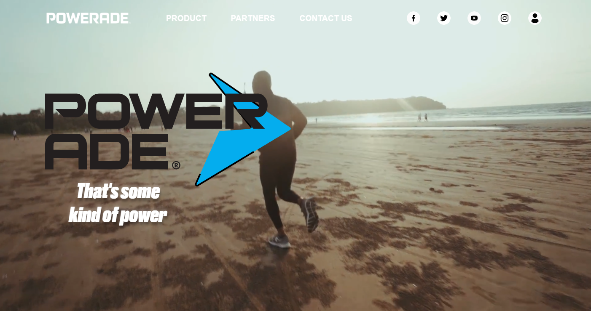
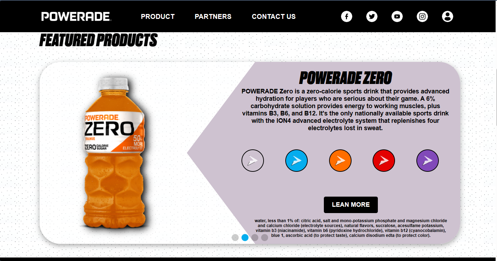

# Powerade

A Powerade é um projeto que queria refazer o site da Powerade Oficial, em minha opinião não ficou melhor e na verdade está longe de ser um site ideal, pois não é tão moderno e a forma que foi executada também não ficou bom, porém é com certeza um começo de uma nova base para novas idéias.

[EN] Powerade is a project that wanted to remake the Official Powerade website, in my opinion it didn't look any better and in fact it's far from being an ideal website, as it's not as modern and the way it was executed wasn't good either, but it's with certainly a beginning of a new basis for new ideas.

## Como rodar o projeto

https://powerade-landingpage.vercel.app/

Linha de comando:

1. Faça download do projeto
2. abra o cmd dentro da raíz do projeto
3. Instale as dependências com `npm install`
4. rode o projeto com `npm run dev`
5. Aprecie 🚀

## Home

## Produtos

## Feedback

Se você tiver algum feedback, por favor me informe para eu evoluir meus conhecimentos.

[EN] If you have any feedback, please let me know so I can improve my knowledge.

## Contribuindo

Contribuições são sempre bem-vindas!

[EN] Contributions are always welcome!

